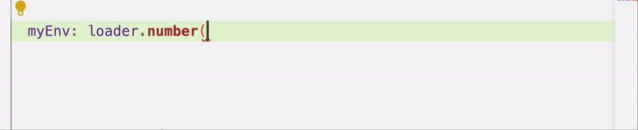
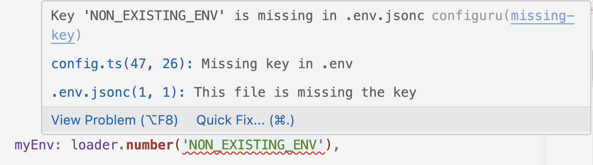
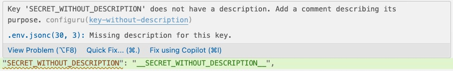
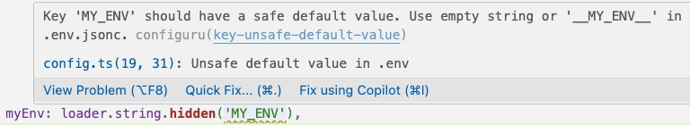

# Configuru - VS Code Extension

VS Code extension for the [Configuru](https://github.com/AckeeCZ/configuru) library.

## Features
Every feature can be enabled/disabled using its configuration key in VSCode settings. All enabled by default.

### Suggestions of name variables
🔧 `configuru.features.suggestEnvVariables`

The extension suggests the names of the variables that are present in the `env.jsonc` file.

### Highlighting of invalid variables
🔧 `configuru.features.highlightInvalidVariables`

If your `config.ts` file contains a variable that is not present in the `env.jsonc` file, the extension will underline it as an error.

### Highlighting of secrets missing a description
🔧 `configuru.features.highlightSecretsMissingDescription`

If your `.env.jsonc` file contains a secret key that does not have description provided in a comment, the extension will underline it as a warning.

### Highlighting of secrets with unsafe default value
🔧 `configuru.features.highlightUnsafeDefaultValues`

If your `config.ts` file contains a hidden variable that is not an empty string or is not prefixed and suffixed with double underscores in `.env.jsonc`, the extension will underline it as a warning.

**Enjoy!**
