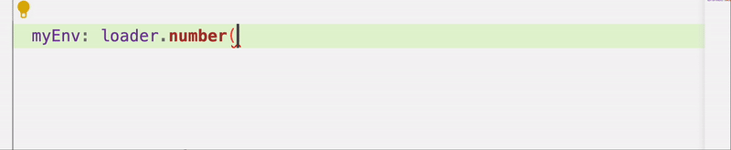
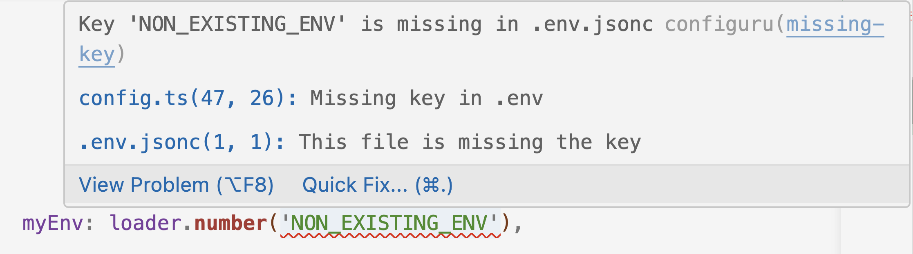

<div align="center">


# Configuru - VS Code Extension

VS Code extension for the [Configuru](https://github.com/AckeeCZ/configuru) library.

</div>

## Features

### Suggestions of name variables
The extension suggests the names of the variables that are present in the `env.jsonc` file.


### Highlighting of invalid variables
If your `config.ts` file contains a variable that is not present in the `env.jsonc` file, the extension will underline it as an error.


### Specifying your env file
If your file with config has different name than `env.jsonc`, you can specify its name in the vscode settings.json.
```
    "configuru.env.paths": [{
        "path": "my-custom-config.jsonc",
        "projectName": "my-project-with-custom-config"
    }]
```

**Enjoy!**
