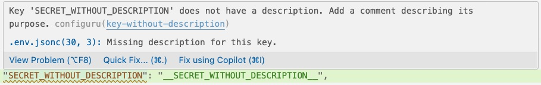
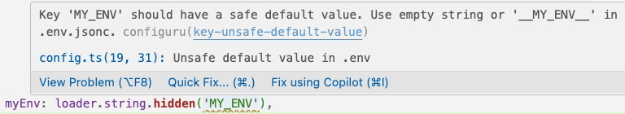
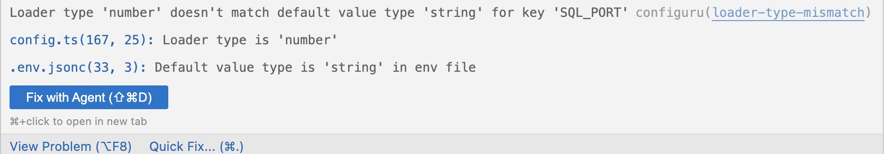

<div align="center">


# Configuru - VS Code Extension

VS Code extension for the [Configuru](https://github.com/AckeeCZ/configuru) library.

</div>

## Setup

Configuru extension by default uses `.env.jsonc` and `src/config.ts` file as a reference.
If you have different file names, env files are located outside of root folder or you use multiple env files in one .ts file, you
need to set file mapping in configuru settings.

Following example shows how to run extension for file `src/config-manager.ts` using two env files `config/development.jsonc` and `config/stage.jsonc`

> ⚠️ Best practice is to set this config for workspace only

```
    "configuru.paths": [{
        "loader": "src/config-manager.ts"
        "envs": ["config/development.jsonc", "config/stage.jsonc"]
    }]
```

## Features

Every feature can be enabled/disabled using its configuration key in VSCode settings. All enabled by default.

### Suggestions of name variables

🔧 `configuru.features.suggestEnvVariables`

The extension suggests the names of the variables that are present in the `env.jsonc` file.


### Highlighting of invalid variables

🔧 `configuru.features.highlightInvalidVariables`

If your `config.ts` file contains a variable that is not present in the `env.jsonc` file, the extension will underline it as an error.


### Highlighting of secrets missing a description

🔧 `configuru.features.highlightSecretsMissingDescription`

If your `.env.jsonc` file contains a secret key that does not have description provided in a comment, the extension will underline it as a warning.


### Highlighting of secrets with unsafe default value

🔧 `configuru.features.highlightUnsafeDefaultValues`

If your `config.ts` file contains a hidden variable that is not an empty string or is not prefixed and suffixed with double underscores in `.env.jsonc`, the extension will underline it as a warning.


### Highlighting of mismatches between loader and default value

🔧 `configuru.features.highlightLoaderTypeMismatch`

If a key in your `config.ts` uses a loader type (e.g. `loader.number`) that is incompatible with its default value in `.env.jsonc`, the extension will underline it as an error. String values that are numeric, boolean, or valid JSON are accepted when the loader can coerce them. Placeholder values (`""` or `__KEY_NAME__`) are always allowed.


**Enjoy!**
